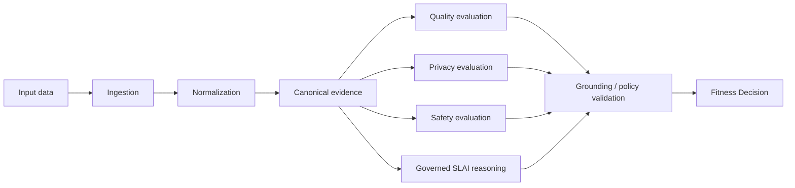

# AIDAP
AI Data Assurance Platform - Validate what enters AI and immediately tells technical buyers what it is.

```text
                    AIDAP
          AI Data Assurance Platform
                      │
              Powered by SLAI
                      │
 ┌────────────────────┼─────────────────────┐
 │                    │                     │
Quality            Privacy               Safety
 │                    │                     │
 └───────────┬────────┴───────────┬─────────┘
             │                    │
        Evaluation            Reasoning
             │                    │
             └────────┬───────────┘
                      ▼
              FITNESS DECISION

        PASS │ REVIEW │ QUARANTINE │ BLOCK
```

It is not merely detecting bad data, but making an auditable decision about whether data is fit to enter a particular AI workflow.


# 4. Canonical dependency hierarchy

AIDAP uses an explicit dependency hierarchy.

The important rule is not merely directory order; it is the **direction of knowledge**.

Lower layers define AIDAP truth and stable contracts. They must not depend on higher orchestration, transport, infrastructure, worker, or SLAI integration layers.

```text
LEVEL 8
┌─────────────────────────────────────────────┐
│ __main__.py                                 │
│ process entry point                         │
└───────────────────────┬─────────────────────┘
                        ↓
LEVEL 7
┌─────────────────────────────────────────────┐
│ bootstrap.py                                │
│ composition root                            │
└───────────────┬─────────────────────────────┘
                ↓
LEVEL 6
┌──────────────┐  ┌──────────────┐  ┌─────────────────────┐
│ api/         │  │ workers/     │  │ concrete adapters   │
│              │  │              │  │ infra/ + slai/      │
└──────┬───────┘  └──────┬───────┘  └──────────┬──────────┘
       │                  │                     │
       └──────────────────┼─────────────────────┘
                          ↓
LEVEL 5
┌─────────────────────────────────────────────┐
│ app/                                        │
│ commands / queries / services               │
│ assurance workflow orchestration            │
└──────────────┬──────────────────┬───────────┘
               ↓                  ↓
LEVEL 4
┌──────────────────────────┐  ┌──────────────────────────┐
│ assurance_engine/        │  │ app/ports/               │
│ deterministic assurance  │  │ dependency inversion     │
│ + fitness decisioning    │  │ boundaries               │
└──────────────┬───────────┘  └──────────────┬───────────┘
               │                             │
               ↓                             │
LEVEL 3                                      │
┌──────────────────────────┐                 │
│ reporting/               │                 │
│ assurance artifacts      │                 │
└──────────────┬───────────┘                 │
               └──────────────┬──────────────┘
                              ↓
LEVEL 2
┌─────────────────────────────────────────────┐
│ contracts/                                  │
│ external/versioned interchange contracts    │
└───────────────────────┬─────────────────────┘
                        ↓
LEVEL 1
┌─────────────────────────────────────────────┐
│ domain/                                     │
│ canonical AIDAP business concepts           │
└─────────────────────────────────────────────┘
```

## 4.1 Dependency rule

The hierarchy is governed by the following rule:

> **Higher layers may know about lower layers. Lower layers must never know about higher layers.**

In particular:

* `domain/` imports no application, engine, infrastructure, API, worker, frontend, or SLAI code.
* `contracts/` may depend on stable domain concepts but never on concrete integrations.
* `reporting/` may depend on contracts and domain representations.
* `assurance_engine/` may depend on domain, contracts, and narrowly defined reporting primitives where required.
* `app/ports/` defines interfaces required from infrastructure and external runtimes.
* `app/` coordinates use cases but does not implement concrete infrastructure.
* `infra/` implements application ports for storage, persistence, queues, identity, scanning, policy retrieval, and other deployment concerns.
* `slai/` implements the governed SLAI application-facing port.
* `api/` and `workers/` are delivery mechanisms.
* `bootstrap.py` is the only composition root.
* `__main__.py` starts an already-composed application.

`configs/`, `docs/`, `tests/`, and `frontend/` are repository concerns rather than backend dependency levels.

---

## 4.2 Ownership of assurance truth

AIDAP owns the meaning of:

* data evidence;
* provenance;
* quality assessments;
* privacy assessments;
* safety assessments;
* assurance policies;
* evaluation results;
* risk and severity semantics;
* Fitness Decisions;
* `PASS`;
* `REVIEW`;
* `QUARANTINE`;
* `BLOCK`;
* decision explanations;
* assurance reports and manifests.

SLAI does not redefine those concepts.

The governing principle is:

> **AIDAP owns data-assurance truth. SLAI supplies governed reasoning capabilities around that truth.**

SLAI may provide contextual reasoning, classification, semantic analysis, synthesis, or other authorized intelligence through a defined application port.

SLAI output becomes AIDAP state only after it crosses an explicit validation and mapping boundary.

An arbitrary model response must never become an authoritative Fitness Decision directly.

---

## 4.3 Canonical assurance flow



The canonical decision vocabulary is:

```text
PASS
REVIEW
QUARANTINE
BLOCK
```

The Fitness Decision must be traceable to the evidence, evaluation results, policy version, and any authorized reasoning that contributed to it.

---

# 5. Repository structure

```text
AIDAP/
├── __init__.py
├── __main__.py
├── bootstrap.py
├── version.py
├── README.md
├── LICENSE
├── .gitignore
│
├── api/
│   ├── README.md
│   ├── __init__.py
│   ├── app.py
│   ├── dependencies.py
│   │
│   ├── middleware/
│   │   ├── correlation.py
│   │   ├── error_mapping.py
│   │   ├── request_limits.py
│   │   └── security.py
│   │
│   ├── routes/
│   │   ├── health.py
│   │   ├── assurance.py
│   │   ├── evaluations.py
│   │   ├── decisions.py
│   │   ├── policies.py
│   │   ├── reports.py
│   │   └── admin.py
│   │
│   └── utils/
│
├── app/
│   ├── README.md
│   ├── __init__.py
│   │
│   ├── commands/
│   │   ├── submit_assurance.py
│   │   ├── evaluate_data.py
│   │   ├── decide_fitness.py
│   │   ├── quarantine_data.py
│   │   └── generate_report.py
│   │
│   ├── queries/
│   │   ├── get_assurance_job.py
│   │   ├── get_evaluation.py
│   │   ├── get_fitness_decision.py
│   │   └── get_report.py
│   │
│   ├── services/
│   │   ├── assurance_service.py
│   │   ├── evaluation_service.py
│   │   ├── decision_service.py
│   │   └── reporting_service.py
│   │
│   ├── ports/
│   │   ├── repository.py
│   │   ├── storage.py
│   │   ├── queue.py
│   │   ├── clock.py
│   │   ├── malware.py
│   │   ├── policy_store.py
│   │   ├── notifications.py
│   │   └── reasoning.py
│   │
│   └── utils/
│
├── assurance_engine/
│   ├── README.md
│   ├── __init__.py
│   ├── context.py
│   ├── engine.py
│   ├── result.py
│   │
│   ├── ingestion/
│   │   ├── loader.py
│   │   ├── detector.py
│   │   └── provenance.py
│   │
│   ├── normalization/
│   │   ├── normalizer.py
│   │   ├── schema.py
│   │   └── canonicalizer.py
│   │
│   ├── evaluators/
│   │   ├── quality/
│   │   ├── privacy/
│   │   └── safety/
│   │
│   ├── decisioning/
│   │   ├── decision_engine.py
│   │   ├── policy.py
│   │   ├── thresholds.py
│   │   └── resolver.py
│   │
│   ├── validation/
│   │   ├── evidence.py
│   │   ├── grounding.py
│   │   ├── coverage.py
│   │   └── reasoning.py
│   │
│   └── utils/
│
├── contracts/
│   ├── README.md
│   ├── __init__.py
│   ├── versions.py
│   │
│   ├── data_asset.py
│   ├── evidence.py
│   ├── provenance.py
│   ├── evaluation.py
│   ├── reasoning.py
│   ├── fitness_decision.py
│   ├── assurance_job.py
│   ├── policy.py
│   ├── report_manifest.py
│   ├── schema_export.py
│   │
│   ├── schema/
│   └── utils/
│
├── domain/
│   ├── README.md
│   ├── __init__.py
│   │
│   ├── data/
│   │   ├── assets.py
│   │   ├── classification.py
│   │   └── sensitivity.py
│   │
│   ├── evidence/
│   │   ├── models.py
│   │   └── provenance.py
│   │
│   ├── evaluations/
│   │   ├── models.py
│   │   ├── quality.py
│   │   ├── privacy.py
│   │   ├── safety.py
│   │   ├── severity.py
│   │   └── confidence.py
│   │
│   ├── decisions/
│   │   ├── models.py
│   │   ├── fitness.py
│   │   └── rationale.py
│   │
│   ├── policies/
│   │   ├── models.py
│   │   ├── rules.py
│   │   └── versions.py
│   │
│   ├── governance/
│   │   ├── authorization.py
│   │   └── review.py
│   │
│   ├── workflows/
│   │   ├── models.py
│   │   └── states.py
│   │
│   ├── reports/
│   │   └── models.py
│   │
│   └── utils/
│
├── reporting/
│   ├── README.md
│   ├── __init__.py
│   ├── artifact_manifest.py
│   ├── package_builder.py
│   ├── report_builder.py
│   │
│   ├── serializers/
│   │   ├── json.py
│   │   ├── csv.py
│   │   └── jsonl.py
│   │
│   ├── templates/
│   └── utils/
│
├── infra/
│   ├── README.md
│   ├── __init__.py
│   │
│   ├── persistence/
│   ├── storage/
│   ├── queues/
│   ├── security/
│   ├── malware/
│   ├── policy_store/
│   ├── notifications/
│   └── utils/
│
├── slai/
│   ├── README.md
│   ├── __init__.py
│   ├── adapter.py
│   ├── agent_policy.py
│   ├── governance.py
│   ├── health.py
│   ├── job_envelope.py
│   ├── orchestration.py
│   ├── result_mapper.py
│   └── utils/
│
├── workers/
│   ├── README.md
│   ├── __init__.py
│   ├── engine.py
│   ├── runner.py
│   ├── reports.py
│   │
│   ├── jobs/
│   │   ├── assurance.py
│   │   ├── evaluation.py
│   │   └── reporting.py
│   │
│   └── utils/
│
├── configs/
│   ├── aidap.yaml
│   ├── assurance.yaml
│   ├── quality.yaml
│   ├── privacy.yaml
│   ├── safety.yaml
│   ├── retention.yaml
│   └── slai_profile.yaml
│
├── docs/
│   ├── architecture/
│   ├── contracts/
│   ├── decisions/
│   ├── policies/
│   └── operations/
│
├── tests/
│   ├── unit/
│   ├── integration/
│   ├── contract/
│   └── fixtures/
│
├── frontend/
│
└── .github/
    └── workflows/
```

## 5.1 Core package responsibilities

### `domain/`

Defines canonical AIDAP meaning.

It contains the business concepts that remain valid regardless of API framework, database, SLAI implementation, queue provider, or deployment architecture.

The domain owns concepts such as:

```text
DataAsset
Evidence
Provenance
Evaluation
QualityAssessment
PrivacyAssessment
SafetyAssessment
AssurancePolicy
FitnessDecision
DecisionRationale
PASS
REVIEW
QUARANTINE
BLOCK
```

---

### `contracts/`

Defines stable and versioned interchange boundaries.

Contracts answer:

> **What may cross an AIDAP boundary?**

They must not become a second domain model.

---

### `assurance_engine/`

Owns deterministic assurance execution.

Its responsibilities include:

```text
ingestion
    ↓
normalization
    ↓
canonical evidence
    ↓
quality evaluation
privacy evaluation
safety evaluation
    ↓
validation / grounding
    ↓
fitness decisioning
```

The Assurance Engine must remain executable independently of HTTP, workers, databases, frontend code, and the concrete SLAI runtime.

---

### `app/`

Coordinates AIDAP use cases.

The application layer decides **when** operations happen but delegates their actual semantics to the domain and Assurance Engine.

Examples include:

```text
SubmitAssurance
EvaluateData
RequestReasoning
DecideFitness
QuarantineData
GenerateReport
```

External requirements are expressed through `app/ports/`.

---

### `slai/`

Provides the concrete governed integration with SLAI.

Conceptually:

```text
app/ports/reasoning.py
          ↑
          │ implements
          │
   slai/adapter.py
          │
          ↓
      SLAI runtime
```

`slai/` may depend inward on AIDAP application contracts.

AIDAP core packages must never depend outward on concrete SLAI runtime implementations.

---

### `infra/`

Contains concrete technical adapters.

Examples include:

* persistence;
* object storage;
* queues;
* malware scanning;
* policy retrieval;
* notifications;
* identity integrations.

Infrastructure implements interfaces defined by `app/ports/`.

---

### `api/`

Translates HTTP requests into application commands and queries.

The API does not own assurance semantics.

---

### `workers/`

Provides asynchronous execution of application workflows.

Workers do not own Quality, Privacy, Safety, or Fitness Decision policy.

---

### `reporting/`

Transforms canonical assurance results into deliverable artifacts.

Reporting does not reinterpret or modify an authoritative Fitness Decision.

---

### `bootstrap.py`

`bootstrap.py` is AIDAP's **only composition root**.

It wires:

```text
configuration
      +
infrastructure adapters
      +
Assurance Engine
      +
SLAI adapter
      +
application services
      +
commands / queries
      +
API / workers
```

Bootstrap performs wiring.

It does not define assurance policy or business meaning.

---

## 5.2 Architectural invariant

The architecture should preserve this invariant:

```text
Domain defines truth.

Contracts define boundaries.

Assurance Engine evaluates truth.

Application coordinates use cases.

Ports define external requirements.

Infrastructure and SLAI implement those requirements.

API and workers deliver the application.

Bootstrap wires everything together.
```

Or, more compactly:

> **Domain → Contracts → Assurance → Application → Adapters → Composition → Process**

Dependencies point inward.

Control may flow outward and back through interfaces, but ownership of AIDAP meaning always remains inward.
